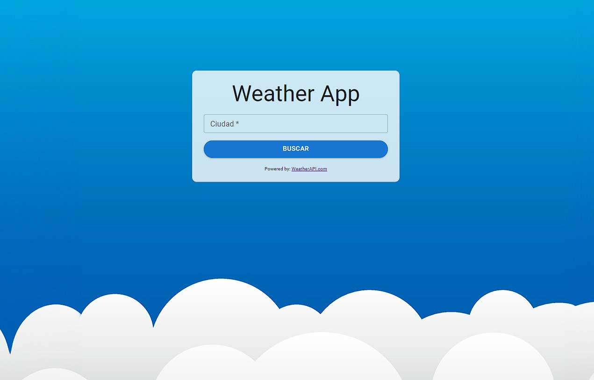
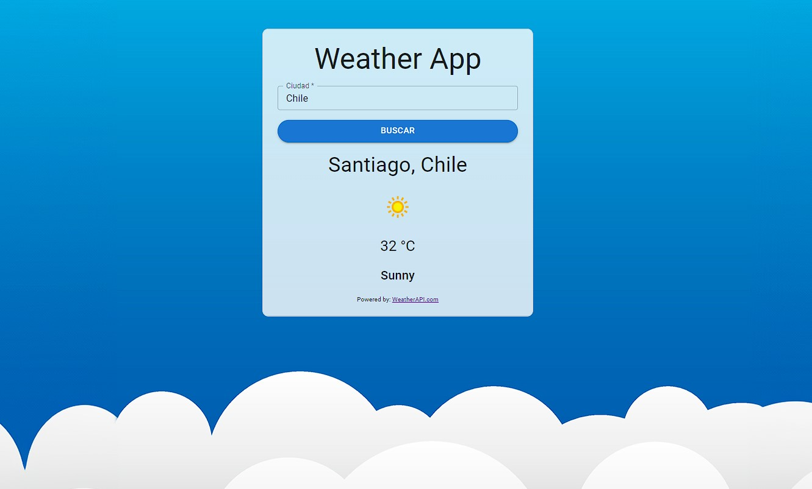

# Weather App

Descripción del Proyecto

La Weather App es una aplicación diseñada para proporcionar información precisa y actualizada sobre el clima. Utiliza tecnologías modernas como React, Vite y JSX para ofrecer una experiencia de usuario fluida y eficiente.

## Screenshots





## Tecnologías Utilizadas

- React: El framework principal para construir la interfaz de usuario interactiva y dinámica.
- Vite: Un entorno de desarrollo rápido para React que mejora la velocidad y eficiencia.
- JSX: Una extensión de sintaxis de JavaScript utilizada con React para la creación de elementos de interfaz de usuario.

## Bibliotecas de Estilo y Fuentes

- Material UI: Se empleó para diseñar componentes de interfaz atractivos y funcionales.
- Fuente Roboto de MUI: Proporciona una apariencia limpia y moderna a la interfaz de usuario.

## API Reference

La aplicación utiliza la API del clima proporcionada por WeatherAPI.com para obtener información precisa y actualizada sobre las condiciones meteorológicas.

#### Get all items

```http
  https://www.weatherapi.com/
```

| Parameter | Type     | Protocol | Format |
| :-------- | :------- | :------- | :----- |
| `api_key` | `string` | https    | JSON   |

## Instalación

Para ejecutar el proyecto:

1. Clona este repositorio: `https://github.com/Francisco-Zambrano/Weather-App.git`

2. Instala las dependencias: npm install
3. Inicia el servidor de desarrollo: `npm start`
4. Inicia la aplicación: npm run dev
5. Ingresa el nombre de la ciudad y haz click en buscar

¡Disfruta de la Weather App y mantente informado sobre el clima!
